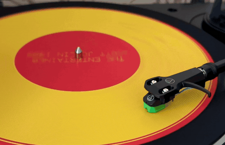
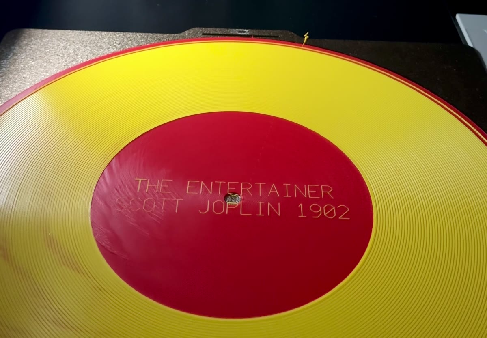
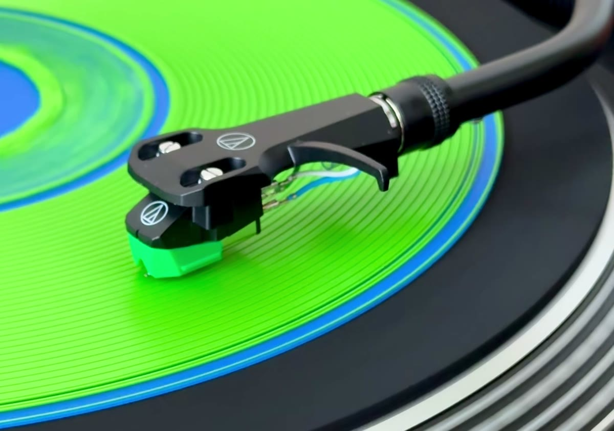

# vinyl-engine

**Turn an audio file into a record you print on an ordinary FDM printer, and then actually play on
a turntable.**

Everybody who has tried this knows how it goes: a 3D printed record is a gimmick that hisses, and
the reason is obvious. A printer resolves 0.2 mm in Z, a record groove is 28 µm deep, so the
waveform gets maybe two bits of amplitude and what comes out is noise with a rhythm in it.

That is true, and it is only true because almost every printed record modulates the groove **up and
down**, along the one axis where a printer is quantised.

This one moves the groove **sideways**.



*The Entertainer (Scott Joplin, 1902), 200 mm, 78 rpm, 0.2 mm nozzle, two colours from an AMS.
Printed on a Bambu Lab P1S, played on an Audio-Technica AT-LP120X with a cheap conical stylus.*

**Video, with sound:** <https://youtube.com/shorts/Oa8asXuxjOY>

**Ready to print**, as 3MF you slice with your own profile, with files for a 0.4 mm and a 0.2 mm
nozzle in each: [The Entertainer](https://makerworld.com/en/models/3355208-playable-3d-printed-record-the-entertainer) · [the rickroll](https://makerworld.com/en/models/3355507-playable-3d-printed-record-the-rickroll)

```
vertical modulation                 lateral modulation
(depth follows the wave)            (the groove wanders left and right)

  ▔▔╲▁▁╱▔▔╲▁▁╱▔▔      Z steps        ╭─╮   ╭─╮   ╭─╮        XY is continuous
  layer height = 0.2 mm             ─╯ ╰───╯ ╰───╯ ╰─       limit is how tightly
  ≈ 2 bits of amplitude                                      a bead can turn
```

XY motion is continuous: no layers, just steppers and firmware smoothing. The amplitude resolution
stops being a printer property and becomes a question of geometry, which turns out to be a question
you can measure, model and design around. Lateral modulation is also what real mono records use, so
an ordinary cartridge reads it correctly.

It is still lo-fi. The usable band ends somewhere between 400 and 2200 Hz depending on nozzle,
speed and radius, and there is audible surface noise throughout. You get the melody and the voice.
You do not get cymbals, and you do not get bass. But you hear the song, and people recognise it
from across the room.

- Developed on a **Bambu Lab P1S**, PLA, 0.4 mm and 0.2 mm nozzles, played on an Audio-Technica
  AT-LP120X at 45 and 78 rpm.
- A CLI and a local web page. Everything runs on your machine; there is no server in this project
  and nothing is uploaded anywhere.
- Every number below was measured on a disc that was printed and played, not derived on paper. The
  full engineering write-up, including the things that were wrong the first three times, is in
  [docs/how-it-works.md](docs/how-it-works.md).

---

| Off the printer | In the groove |
|---|---|
|  |  |

The label text is engraved with the same single stroke font the G-code uses, and the colour change
happens at the layer where the flat base ends and the grooves begin.

## How the groove is built

The groove axis follows the audio:

```
r(θ) = r_spiral(θ) + A · x(t(θ))
```

and the groove itself is a stepped V trench, wide enough at the top for a stylus to sit in and
narrow at the floor, built from pairs of extrusion beads that step outward layer by layer:

```
   wall layer 2   ▁▁▁▁▁▁            ▁▁▁▁▁▁       each layer steps outward by
   wall layer 1     ▁▁▁▁▁        ▁▁▁▁▁           wallStep, so the trench widens
   wall layer 0       ▁▁▁▁      ▁▁▁▁             with depth like a stylus cone
   solid base    ████████████████████████
                          ↑
                  the floor, one gap wide
```

Both beads of a pair carry the same `A · x(t)`, so the whole trench moves sideways together, and a
land bead of varying width fills the ridge between neighbouring turns.

The first design used the cusp between two touching beads as the groove. Printed, it closed up into
a flat ridge. That failure, and the measurements that came out of it, is why the geometry looks
like this.

## The one equation that matters

An extruded bead cannot follow an arbitrarily tight curve. Push it too far and the material smears
across the corner, the wall bulges into the channel, and the groove prints itself shut. For a sine
of amplitude `A` and wavelength `L`, the radius of curvature at the peak is `L²/(4π²A)`, so:

```
f_max(r) = v(r) / (2π·√(minCurvature · A)),      v(r) = 2π·r·rpm/60
```

`minCurvature = 0.17 mm` for a 0.42 mm bead. That is measured, not assumed: a test disc at 45 rpm
and A = 0.15 mm fell off a cliff at 540 Hz at a radius of 115 mm, exactly where its path curvature
reaches 0.17 mm. Playing it back gave 470 Hz at −19 dB and 680 Hz at −37 dB against a predicted
cliff at 540 Hz.

Two things follow, and both of them shape everything else in this repository:

- **Amplitude costs bandwidth.** Doubling `A` needs a wave 41% longer, so it lowers the ceiling by
  29%. Loudness and treble are the same budget.
- **The disc gets darker as it plays.** `v(r)` falls as the groove spirals inward, so the ceiling
  falls with it. The audio path therefore applies a *time varying* lowpass: the signal is processed
  in 0.5 s blocks and each block is filtered at the ceiling for the radius where it will land.

## What fits on a disc

| Nozzle | Disc | 78 rpm | 45 rpm | 33⅓ rpm |
|---|---|---|---|---|
| 0.4 mm | 250 mm | 27 s, 1200→558 Hz | 47 s, 692→322 Hz | 63 s, 512→238 Hz |
| 0.4 mm | 200 mm | 15 s, 967→558 Hz | 27 s, 558→322 Hz | 36 s, 413→238 Hz |
| 0.2 mm | 250 mm | 45 s, 2170→996 Hz | 77 s, 1252→575 Hz | 105 s, 927→425 Hz |
| 0.2 mm | 200 mm | 26 s, 1726→996 Hz | 45 s, 996→575 Hz | 61 s, 737→425 Hz |

Two numbers per cell: how much audio fits, and the usable band at the rim → at the label.

Speed buys bandwidth and costs length; 78 rpm is 2.3 times brighter than 33⅓ and holds 2.3 times
less. At 33⅓ the band ends around 425 Hz, below most of a singing voice, which is exactly what
people mean when they say a printed record sounds like it is playing in the next room. Print times:
about 3 hours for a 250 mm disc at 0.4 mm, about 8 at 0.2 mm.

## Install

You need **Node 22 or newer**, and **ffmpeg** if you want the command line to read mp3 or mp4 (the
browser decodes audio by itself, so the web page does not need it).

```bash
# macOS
brew install node ffmpeg

# Windows, in PowerShell
winget install OpenJS.NodeJS.LTS Gyan.FFmpeg

# Debian or Ubuntu
sudo apt install nodejs npm ffmpeg
```

Then:

```bash
git clone https://github.com/TanskiSzymon/vinyl-engine
cd vinyl-engine
npm install
npm test            # optional, 113 tests, takes a few seconds
```

Nothing is installed globally, nothing runs in the background, and no account is involved.

### Or have an AI agent do it

If you use Claude Code, Codex, Cursor or anything similar, paste this at it:

> Set up https://github.com/TanskiSzymon/vinyl-engine on my machine, read its AGENTS.md, and make
> me a printable record of The Entertainer for a Bambu P1S with a 0.4 mm nozzle.

[AGENTS.md](AGENTS.md) tells the agent what it needs: the prerequisites, how to choose the speed
and diameter, which template to use, and how to check the result before you spend three hours of
printer time on it. Replace the tune with your own file once the first disc plays.

## Quick start

**The web page**, if you would rather click than type:

```bash
npm run dev      # http://localhost:3000
```

Drop in a printer template (below), pick a built in tune or your own file, and download the result.
It draws the real disc layout as you change settings and plays back what the groove will contain.

**The command line:**

```bash
# a public domain melody, no audio file needed: the fastest way to a first disc
npm run cli -- melody --template templates/bambu-p1s-0.4.gcode.3mf \
  --out out/entertainer.gcode.3mf --tune entertainer --rpm 78 --diameter 250

# your own audio, starting 43 s in, with an engraved label and a centre pattern
npm run cli -- generate song.mp3 --template templates/bambu-p1s-0.4.gcode.3mf \
  --out out/record.gcode.3mf --rpm 45 --start 43 --decor rings --text "SIDE A|1987"

# a fine nozzle: one flag sets the whole coherent profile, not just the width
npm run cli -- melody --template templates/bambu-p1s-0.2.gcode.3mf \
  --out out/fine.gcode.3mf --nozzle 0.2 --tune entertainer --rpm 78 --diameter 200

# a 3MF solid to slice yourself, instead of finished G-code
npm run cli -- model song.mp3 --out out/disc.3mf --rpm 45

npm run cli      # every command and flag
```

Start with `melody` at 78 rpm on a small disc. It needs no files, it is the shortest print, and if
it plays, everything downstream of it works.

## The printer template

The engine writes the body of the print, not your printer's start-up routine: bed levelling, purge
line, temperatures, the end sequence. It takes those from a file you slice yourself, so your own
profile is always in charge of how the machine behaves.

`templates/` ships two, sliced for a Bambu Lab P1S with a 0.4 mm and a 0.2 mm nozzle. For any other
printer or profile, make one once:

1. Load any small object in your slicer, ideally a 10 mm cube.
2. Slice it with the profile you will actually print the disc with: your printer, your nozzle, PLA,
   your build plate.
3. Export the sliced plate as a `.gcode.3mf` (in Bambu Studio: Export → Export plate sliced file).

Only the first and last block of that file are used. Everything in between is written by the
engine, which also rewrites the declared nozzle, layer height, layer count and the bed probing area
so the printer is told the truth about what it is printing. That last one matters more than it
sounds: a template made from a 10 mm cube probes 1 cm² in the middle of the bed, and a disc is
25 cm across.

## Printing and playing

- **Watch the first layer.** A patchy base means a bad groove, and you are three hours from finding
  that out.
- Two colours are supported, base in one and grooves in the other: `--color-change` for a pause and
  a manual spool swap, `--ams-slot N` for a real AMS toolchange.
- On the turntable: the speed the tool tells you, tracking force about 2 g, anti-skate 2. Lower the
  needle with the cueing lever onto the wide run-in groove at the edge.
- **Use a cheap cartridge.** PLA is softer than vinyl and wears a stylus faster than vinyl does.
  Treat the needle as a consumable and keep your good one for records.
- If the stylus skates across the surface instead of tracking, the groove is too shallow or the
  excursion too large for it: lower `--amp` or raise `--wall-layers`.
- If you would rather not send machine written G-code to your printer at all, switch the output to
  a 3MF model and slice it yourself. You lose about half the playing time, because a slicer needs
  room for its own extrusion paths between the grooves, and you gain the ability to inspect the
  thing first.

## Tuning it to your turntable

Every cartridge, preamp and platter has its own response, so the engine can measure yours and
correct for it:

```bash
npm run cli -- calib --template templates/bambu-p1s-0.4.gcode.3mf --out out/calib.gcode.3mf --rpm 45
# print it, play it, record the output over USB, export as WAV, then:
npm run cli -- calibrate recording.wav --segments out/calib-segments.json --out calibration.json --rpm 45
npm run cli -- generate song.mp3 --calibration calibration.json ...
```

The tuning disc is blocks of eight tones, repeating to the label, so every block lands at a
different radius. The calibrator aligns your recording against the reference by envelope
correlation, measures each tone against what should have been heard, fits level against radius, and
applies the inverse as a radius dependent FIR before the next disc is cut. It also notices that
your platter runs 1% fast and corrects the timebase, because otherwise the twentieth measurement
window lands in a gap. The same loop is step 05 in the web UI.

## What is in here

| Path | What is in it |
|---|---|
| `src/record/` | disc parameters, capacity and bandwidth maths, spiral geometry, assembly |
| `src/gcode/` | the G-code writer, groove layers, base, decoration, a single stroke font, 3MF packing |
| `src/audio/` | filters, RIAA, compression, the public domain tune library, test signals |
| `src/analysis/` | the calibration loop: alignment, Goertzel measurement, FIR design |
| `src/mesh/` | watertight mesh and 3MF export for the slice-it-yourself path |
| `src/cli.ts` | the command line interface |
| `app/` | the local web UI (Next.js, all computation client side, in a Web Worker) |
| `templates/` | ready made Bambu P1S templates |
| `docs/` | [how it works](docs/how-it-works.md) · [prior art](docs/prior-art.md) · [which music you may cut](docs/public-domain-music.md) |
| `AGENTS.md` | setup and generation instructions for an AI agent doing this on someone's behalf |

```bash
npm test          # 113 tests, including an end-to-end one that reads the audio back out
                  # of the finished G-code and counts cycles per revolution, which is
                  # exactly what a stylus does
npm run typecheck
```

No framework magic in the engine: no mesh, no slicer, no dependencies beyond a zip library. The
spiral is one continuous extrusion path, written directly, and a whole disc is a few MB of G-code.

## What this will never be

A 0.4 mm extrusion is roughly ten times coarser than a cut groove, and a 1.73 mm groove pitch is 17
times coarser than a microgroove LP. Surface noise is audible throughout, the band ends between 425
and 2200 Hz, and bass is spent on amplitude that costs you treble. This is a novelty that plays,
not a format.

It also chews stylus tips. Cheap cartridge, always.

## Status

Built, used, and then stopped: the author no longer owns a turntable and has no time to take it
further. It is published as is, in the hope that somebody does. Obvious next steps if you are
looking for one:

- the 0.2 mm mesh profile is scaled from extrusion width, not printed and measured like the
  G-code path
- nothing but the Bambu P1S has been tested end to end, though the engine only emits ordinary moves
  and extrusions, so other printers should work
- `minCurvature` for a 0.2 mm nozzle is scaled from the 0.4 mm measurement, not measured
- stereo, or two independently modulated walls, has never been tried
- nobody has tested whether a slower, cooler print lowers the surface noise floor

Issues and pull requests are welcome; reviews will be slow and honest.

## Credit

The idea that a printed disc can play at all comes from Amanda Ghassaei's
[3D Printed Record](https://www.instructables.com/3D-Printed-Record/) (2012). Her published groove
dimensions and her matrix test disc method, print many rings with different parameters and read the
answer off one recording, saved months of guessing here. See [docs/prior-art.md](docs/prior-art.md).

The built in tunes are synthesised from note sequences rather than sampled, so no recording is
involved. For your own files, and for the difference between a composition and a recording, see
[docs/public-domain-music.md](docs/public-domain-music.md).

MIT licensed. Print at your own risk, and do not put PLA under an expensive stylus.
